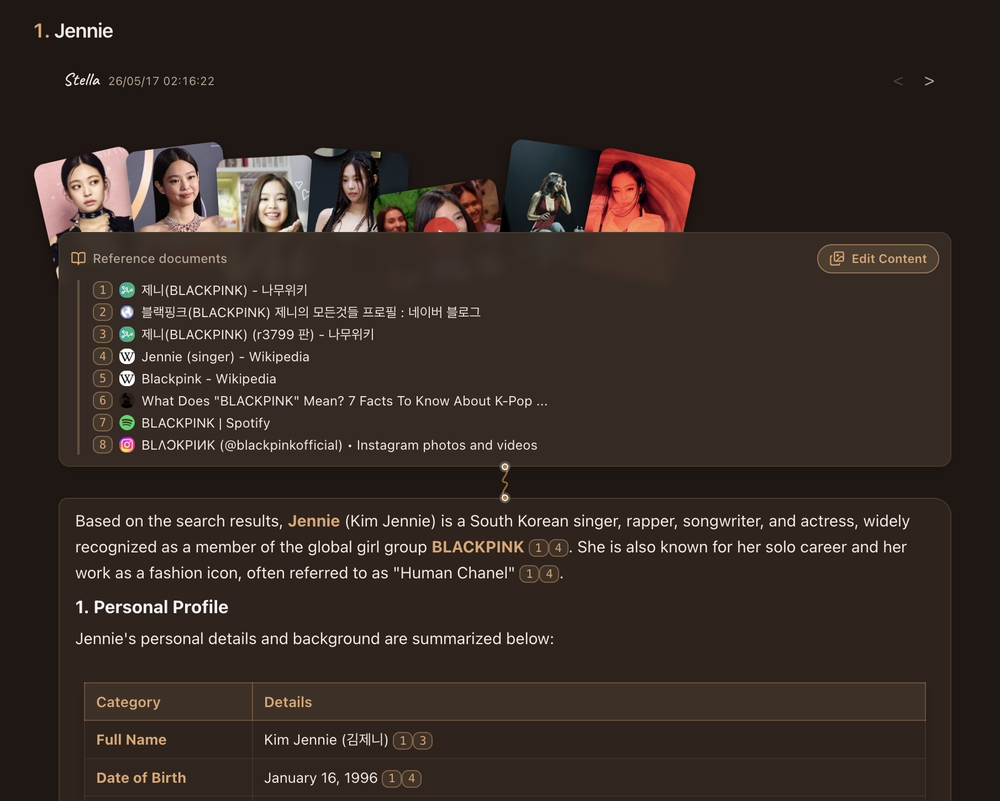
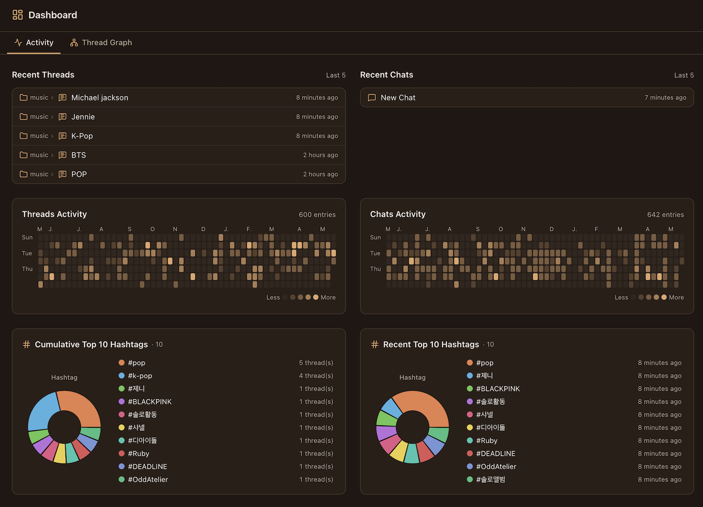
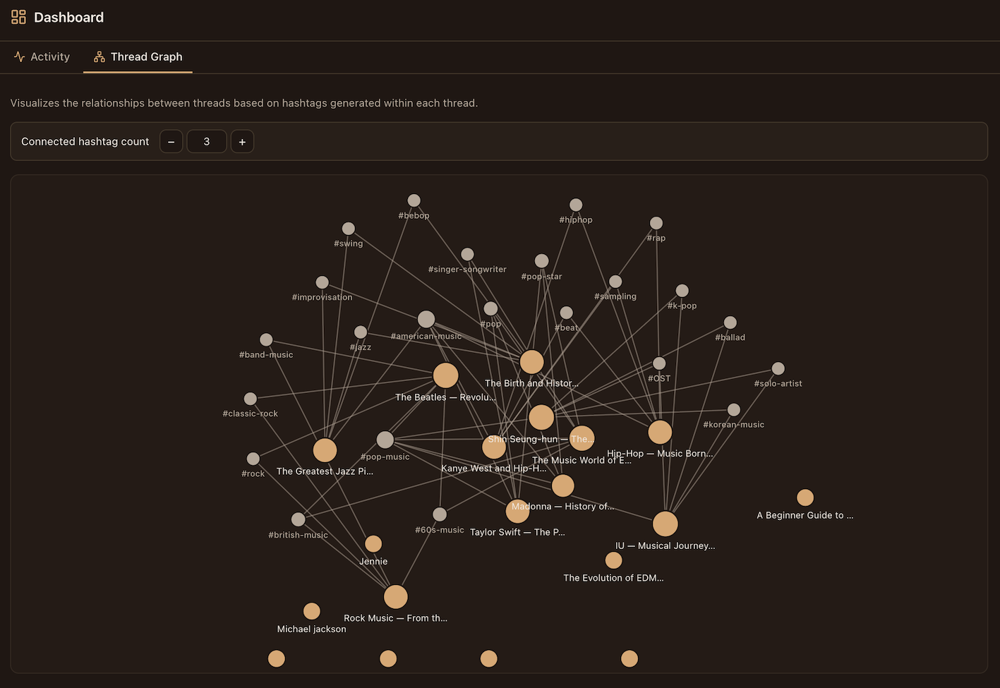

[](https://nextjs.org/)
[](https://nestjs.com/)
[](https://tavily.com/)
[](./LICENSE)

# Stella's Thread House

* 제니의 빅팬입니다. 저작권에 문제가 있다면 삭제하도록 하겠습니다.
## 개요
AI에게 정보를 획득하여 별도의 문서로 옮겨 관리하기 보다 응답 자체를 문서화하여 지식을 항구적으로 관리할순 없을까? 현재 문서와 다른 문서간에 연관성을 고려하여 관계된 문서를 자동으로 연결하여 정보의 탐색을 용이하게 할 순 없을까? 라는 단순한 물음에서 본 서비스를 만들게 되었습니다. 

## 동작에 대한 설명
사용자가 LLM에게 한 질문은 곧 소제목이 될수 있습니다. 예를 들어 "우리나라의 근대사에 대해 알려줘"라는 요청 메시지는 곧 "우리나라의 근대사"라는 제목으로 변경할 수 있을 것입니다. 또한 이를 통해 생성된 답변을 기반으로 hashtag를 AI를 통해 자동생성하여 다른 문서에서 작성된 hashtag와의 일치성을 기준으로 문서 간에 연관성(Related documents)을 맺을 수 있을 것입니다. 물론 hashtag는 동형이의어가 존재합니다. 따라서 한개의 hashtag 연결보다 복수개가 연결 되었을때 더욱 근접한 문서가 될 것입니다. 그리고 웹 검색을 통해 LLM이 응답을 하면 참조한 문서(Reference documents)를 시각화하고 해당 웹 문서를 넘버링화 하여 답변에서 어떤 문서를 기반으로 응답했는지를 표기하게 하였습니다. 위를 내용을 바탕으로 미약하지만 제텔카스텐 기법을 적용하였습니다.
## 기능 상세
### 사용 모드
Thread, Chat 두 모드가 존재합니다. Thread로 작성을 하면 hashtag를 자동으로 생성하여 문서들간에 연결합니다. 캐주얼하게 가볍게 질문을 하고 싶다면 Chat을 사용하면 됩니다. 하지만 Chat 모드는 AI 발화 처리에 있어 베이스 엔진은 동일하나 hashtag 연결을 통한 관련 문서 연결 및 발화 메시지 수정에 대해서는 제공하지 않습니다.
### Thread 모드
1. Reference documents
  - AI가 답변을 위해 웹 검색을 하면 실제 참조한 웹 리스트가 넘버링되며 바로 위에는 웹 검색을 통해 나온 이미지등의 컨텐츠들이 자리를 잡게 됩니다. 이때 문서와 관련된 핵심 이미지나 youtube의 경우 pin을 사용하여 화면에 고정시킬 수 있습니다. 또한 컨텐츠 에디터를 통해 불필요한 이미지를 삭제할 수 있으며 이미지의 위치 또한 조정이 가능합니다. 
2. 사용자 발화 -> 소제목 변경
  - 사용자 발화 메시지 클릭을 통해 제목으로 수정이 가능합니다.
3. 우측 메뉴
  - 소제목 기준 위 아래 순서 조정 및 이동 기능
  - 소제목 기준 문서 세트(질의,응답)를 삭제 기능
  - AI가 생성한 hashtag 관리 (추가,삭제 기능)
  - Related Documents
    - hashtag로 연결된 관련된 문서를 탐색합니다.
### 대시보드
- 최신 작성 글 탐색 및 hashtag 생성 정보 

- 전체 문서의 연결된 정보 시각화 제공 


## 응용방법
저는 이렇게 씁니다.
1. 유튜브의 링크를 주고 요약 요청, pip모드로 재생하며 중간중간 궁금증에 대해 질의를 하며 공부
2. 책에 대해 웹검색을 통한 요약, 책 내용 촬영하여 요약 또는 궁금한 부분을 질의 하여 문서화
3. 특정 주제에 맞는 웹 링크를 주며 내용 정리

## 필수사항
현재 Ollama를 통해 설치한 Gemma4 26b에 최적화 되어 있습니다.

|구분|용도|
|--|--|
|Local LLM|Ollama를 통해 설치한 Gemma4 26b|
|Tavily API Key|웹 검색 용|


# Deploy

## 1. `.env` 파일 작성

```env
# ── 필수 ──────────────────────────────────────────
# 최초 부팅 시 생성되는 관리자 계정
TH_ADMIN_EMAIL_ID=admin@example.com
TH_ADMIN_PASSWORD=changeme1234

# Ollama API 엔드포인트 (OLLAMA_GEMMA4_URL 는 레거시 별칭)
OLLAMA_BASE_URL=http://ai.example.com:11434

# ── 선택 ──────────────────────────────────────────
# 웹 검색 기능 (없으면 웹 검색 비활성)
TAVILY_API_KEY=tvly-xxxxxxxxxxxxxxxxxxxxx

# DB 계정 (기본값 사용 시 생략 가능)
# POSTGRES_USER=stella
# POSTGRES_PASSWORD=stella_dev_pass
# POSTGRES_DB=stella
```

## 2. `docker-compose.yml` 작성

```yaml
services:
  postgres:
    image: postgres:18-alpine
    container_name: stella-th-postgres
    restart: unless-stopped
    environment:
      POSTGRES_DB: ${POSTGRES_DB:-stella}
      POSTGRES_USER: ${POSTGRES_USER:-stella}
      POSTGRES_PASSWORD: ${POSTGRES_PASSWORD:-stella_dev_pass}
    volumes:
      - postgres-data:/var/lib/postgresql/18/docker
    networks:
      - stella-net
    healthcheck:
      test: ["CMD-SHELL", "pg_isready -U ${POSTGRES_USER:-stella} -d ${POSTGRES_DB:-stella}"]
      interval: 5s
      timeout: 5s
      retries: 20
      start_period: 10s

  app:
    image: registry.webnori.com/stella-th:1.2.7   # 최신 태그로 교체
    container_name: stella-th-app
    restart: unless-stopped
    ports:
      - "4100:4100"   # backend (NestJS)
      - "3100:3100"   # frontend (Next.js)
    env_file:
      - .env
    environment:
      DATABASE_URL: postgres://${POSTGRES_USER:-stella}:${POSTGRES_PASSWORD:-stella_dev_pass}@postgres:5432/${POSTGRES_DB:-stella}
      UPLOAD_DIR: /app/backend/uploads
      LOG_DIR: /app/backend/logs
    volumes:
      - attachments-data:/app/backend/uploads
      - logs-data:/app/backend/logs
    depends_on:
      postgres:
        condition: service_healthy
    networks:
      - stella-net
    extra_hosts:
      - "host.docker.internal:host-gateway"   # Linux에서 호스트 Ollama 접근 시 필요

networks:
  stella-net:
    driver: bridge

volumes:
  postgres-data:
  attachments-data:
  logs-data:
```

## 3. 실행

```bash
docker compose up -d
```

| 서비스 | URL |
|--------|-----|
| Frontend | http://localhost:3100 |
| Backend API | http://localhost:4100 |

> **참고**  
> - `OLLAMA_BASE_URL`(레거시: `OLLAMA_GEMMA4_URL`) / `OPENAI_BASE_URL` / `OPENAI_API_KEY` / `TAVILY_API_KEY`는 최초 부팅 시 DB에 시드됩니다. 이후 Settings → AI 에서 변경하면 DB 값이 우선 적용됩니다. OpenAI 호환 공급자를 쓰려면 `AI_PROVIDER=openai-compatible` 로 설정하세요.  
> - Linux 호스트에서 Ollama를 로컬 실행 중이라면 `extra_hosts` 항목이 필요합니다. Mac/Windows Docker Desktop은 `host.docker.internal`이 자동 해석되므로 생략 가능합니다.
